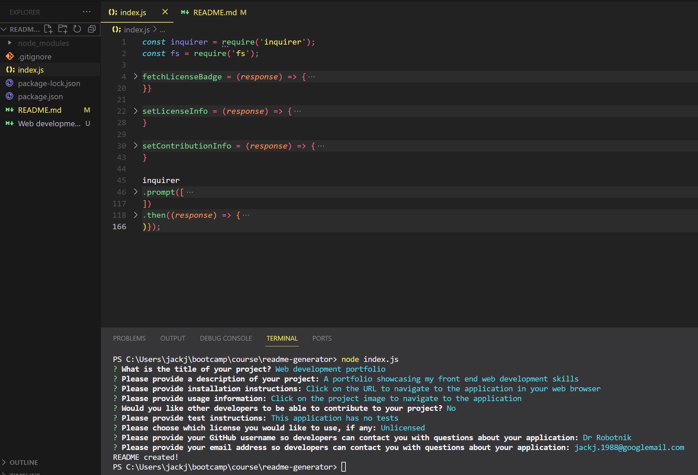

# Jack Johnson's README Generator

## Description

A command-line application that dynamically generates a professional README.md file from a user's input.

## Table of Contents

- [Installation](#installation)
- [Usage](#usage)
- [Credits](#credits)
- [License](#license)

## Installation

- Install node.js on your system.
- Save the README-generator code to your hard drive.
- Navigate to the folder containing index.js, either with the command prompt or with VS Code's integrated terminal. 
- Type "node index.js" to run the application

## Usage

The README generator will ask the first question - What is the title of your project? Type this in and proceed through the remainder of the questions.

There are two questions that require you to use the arrows on your keyboard to select your choice.

Once completed the README will be generated and saved in the same folder as the index.js file.

Refer to this video walkthrough demonstrating how to use the application https://drive.google.com/file/d/1f-GpZMXm9IRqGjjC38fyAPos-KioeGgV/view

## Credits

I would like to acknowledge my peers in Sibert-pod-11. We're all on the same learning journey and have helped each other massively during the front-end web development skills boot camp.

I would like to acknowledge the README guide found at the following repository, which I used for the text in the contribution section: https://github.com/othneildrew/Best-README-Template

Finally, thanks to the author of the following website which I direct users to for more information on choosing a license https://choosealicense.com/ 

## License

No license chosen